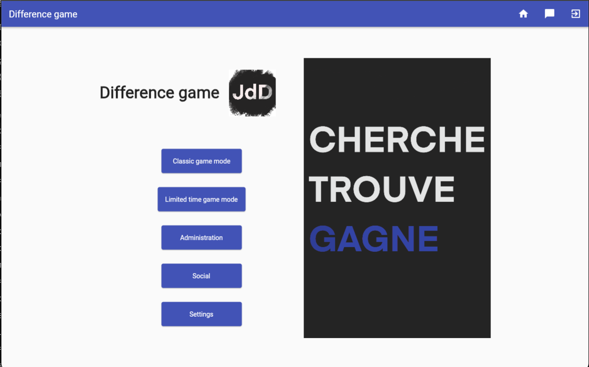
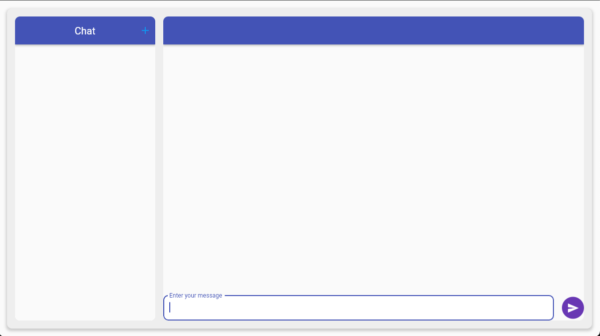
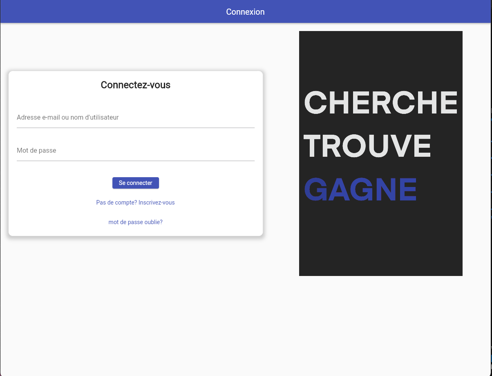
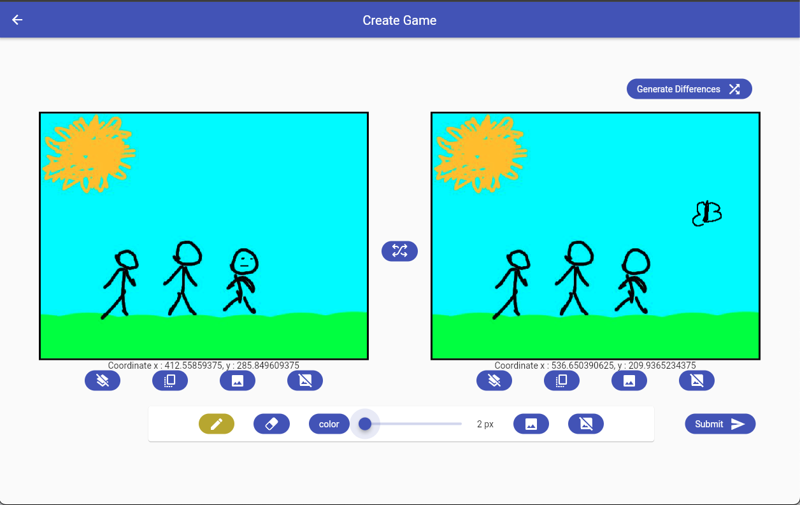

### 🕵️‍♂️ Seven Differences – Multiplayer Game

Seven Differences is a multiplayer mobile game developed with Flutter as part of a 14-week academic project completed by a team of 6 students. The goal of the game is to find the seven differences between two similar images as quickly as possible, either solo or against other players in real time.

The application is built with a client–server architecture. The mobile client communicates with a Node.js backend using a combination of REST APIs and WebSockets to ensure both reliable data persistence and real-time interactions.

## 🎮 Gameplay Features

Interactive “find the 7 differences” gameplay

Real-time multiplayer support

Player scoring and game state synchronization

Responsive UI built with Flutter

## 🧱 Technical Architecture

Frontend: Flutter (cross-platform mobile application) & Angular

Backend: Node.js + MongoDB

Real-time communication: WebSockets (for live game updates)

Data exchange: REST APIs (for authentication, game data, and persistence)

Database: Centralized storage accessed via the backend API

Authentication : Firebase

## 👥 Team & Project Context

Duration: 14 weeks

Team size: 6 developers

Context: Academic project focused on software architecture, networking, and collaborative development

This project emphasizes clean architecture, real-time communication, and teamwork, while delivering a complete and playable mobile game experience.

